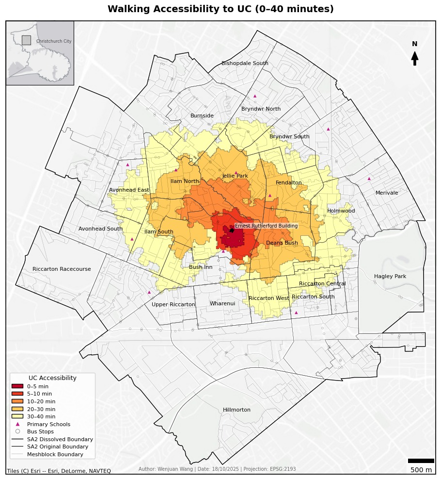
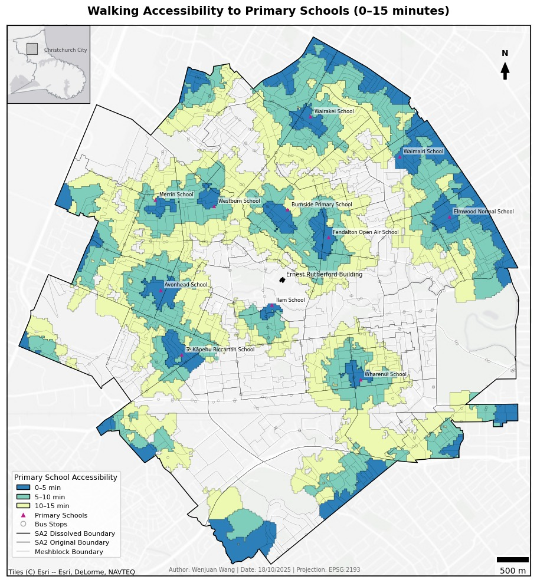
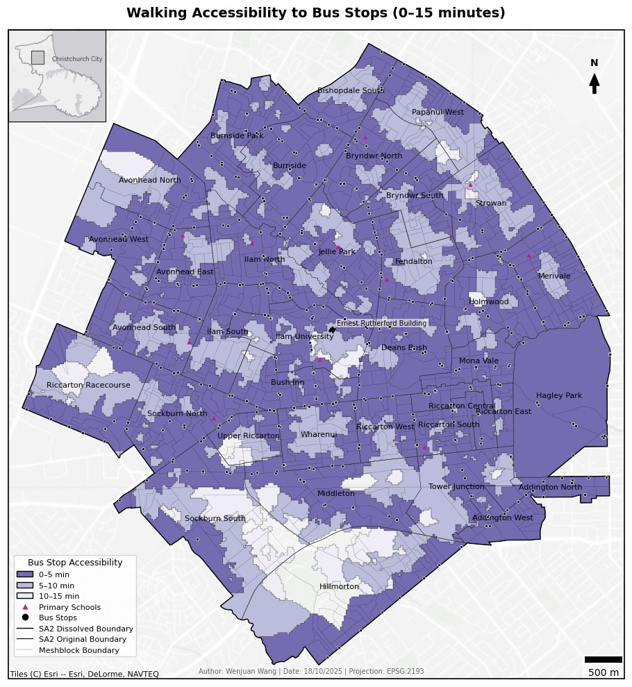
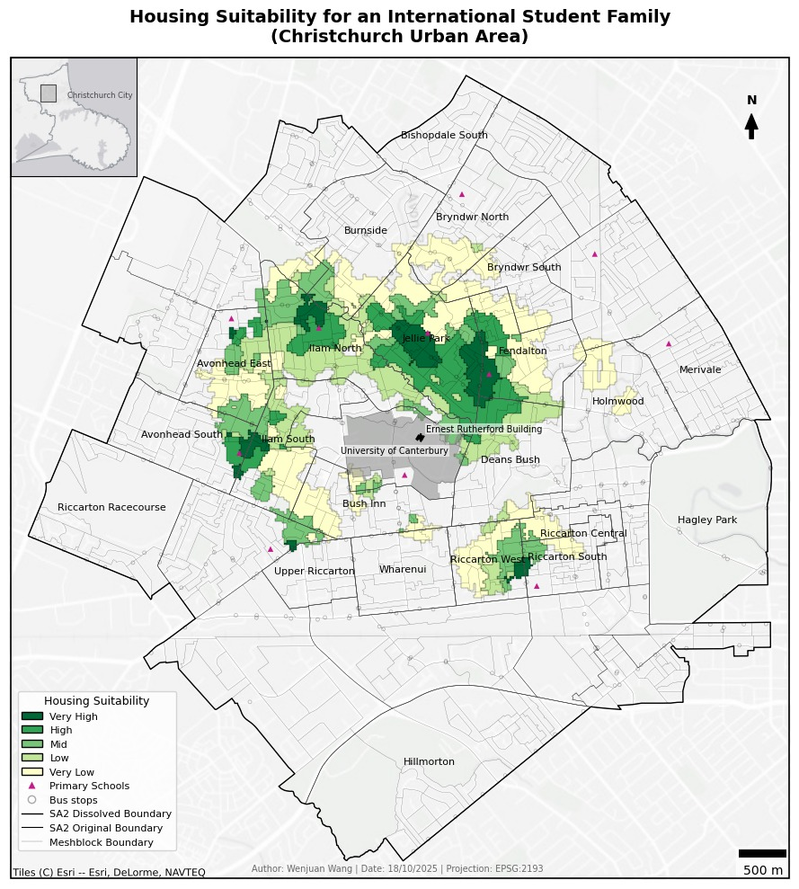

# International Student Family Housing Site Selection in Christchurch

This project implements a **GIS-based spatial accessibility model** to identify suitable housing areas for international student families with primary school-aged children, who do not own private vehicles in Christchurch, New Zealand.  

Developed as part of the **GISC412 course (2025)** at the University of Canterbury.

---

## 🧭 Objectives
- Build a reproducible spatial analysis framework for housing site selection.
- Evaluate accessibility to **primary schools, University of Canterbury, and bus stops**.
- Generate composite suitability maps highlighting top residential zones.

---

## 📊 Data & Methods
- **Data sources**: Stats NZ (SA2, meshblock), OpenStreetMap (road network, schools, bus stops), Wikipedia (school list).  
- **Tools**: Python (GeoPandas, OSMnx, NetworkX, Pandas, Matplotlib, Contextily), Jupyter Notebook.  
- **Workflow**:
  1. Extract and clean open-source data.
  2. Build pedestrian network (1.2 m/s walking speed).
  3. Compute **network-based isochrones** (UC 40 min, schools 15 min, bus stops 15 min).
  4. Overlay and weight suitability (Schools 0.50, UC 0.35, Bus 0.15).
  5. Classify into five levels (Very Low → Very High).
  6. Produce final maps and SA2-based summaries.

---

## 🗺 Results

### UC Accessibility (0–40 min walk)

### Primary School Accessibility (0–15 min walk)

### Bus Stop Accessibility (0–15 min walk)

### Composite Suitability Map

Top high-suitability areas: **Jellie Park, Ilam North, Fendalton**, with smaller clusters in Avonhead and Riccarton.

---

## 📂 Repository Structure
notebooks/ → Jupyter notebooks (Python analysis)
report/ → Final PDF report
figures/ → Maps and charts
outputs/ → Spatial outputs (GeoPackage/CSV)
data/ → Sample datasets (small extracts only)
